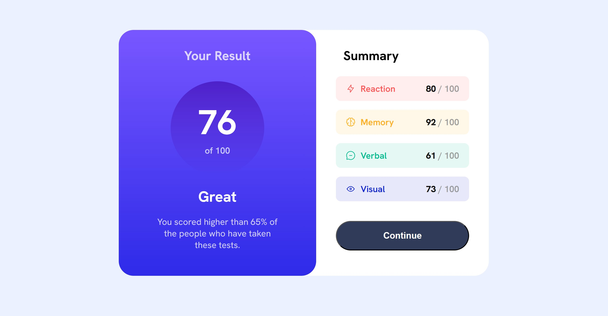

# Frontend Mentor - Results summary component solution

This is a solution to the [Results summary component challenge on Frontend Mentor](https://www.frontendmentor.io/challenges/results-summary-component-CE_K6s0maV). Frontend Mentor challenges help you improve your coding skills by building realistic projects. 

## Table of contents

- [Overview](#overview)
  - [The challenge](#the-challenge)
  - [Screenshot](#screenshot)
  - [Links](#links)
- [My process](#my-process)
  - [Built with](#built-with)
  - [What I learned](#what-i-learned)
  - [AI Collaboration](#ai-collaboration)
- [Author](#author)

## Overview

### The challenge

Users should be able to:

- View the optimal layout for the interface depending on their device's screen size
- See hover and focus states for all interactive elements on the page

### Screenshot

### Links

- Solution URL: [Click here](https://your-solution-url.com)
- Live Site URL: [Click here](https://khaledsilva.github.io/results-summary/)

## My process

### Built with

- Semantic HTML5 markup
- CSS custom properties
- Flexbox
- CSS Grid
- Mobile-first workflow
- [React](https://reactjs.org/) - JS library
- [Next.js](https://nextjs.org/) - React framework
- [Styled Components](https://styled-components.com/) - For styles

### What I learned

I learned how to use media queries and make a website more responsive by using the rem unit of measurement and aligning elements with flexbox.

### AI Collaboration

I used ChatGPT to convert all units from px to rem and to adjust some CSS properties, such as overlapping divs to avoid gaps, making it look like the example.

## Author

- Github - [@KhaledSilva](https://github.com/KhaledSilva)
- Frontend Mentor - [@KhaledSilva](https://www.frontendmentor.io/solutions/responsive-landing-page-using-a-css-flexbox-and-media-queries-4ZktcQEL7O)
- Linkedin - [@khaled-silva](https://www.linkedin.com/in/khaled-silva/)
